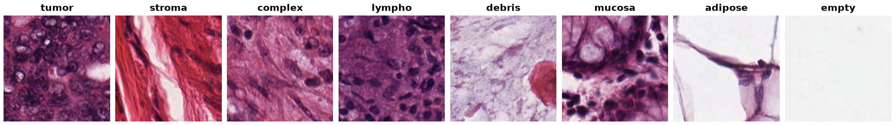

Kather Colorectal Histology
===========================

.. raw:: html

   

   
   
   
   

Overview
--------

Kather Colorectal Histology is an eight-class tissue-texture classification
dataset with 5,000 H&E-stained colorectal histology tiles. Each tile belongs to
one tissue category.

- **Train**: 5,000 images, with 625 per class.
- **Images**: 150×150 RGB TIFF tiles, stored by the builder as RGB PNGs without resizing.
- **Official splits**: none; the builder exposes the entire tile release as ``train``.
- **Download**: the 246 MiB tile archive, verified against Zenodo's published MD5 checksum;
  the separate larger-image archive is not downloaded.
- **License**: CC BY 4.0; attribute the dataset and cite the original paper.

Data Structure
--------------

Accessing ``ds[i]`` returns a dictionary with these fields:

.. list-table::
   :header-rows: 1
   :widths: 22 20 58

   * - Key
     - Type
     - Description
   * - ``image``
     - ``PIL.Image.Image``
     - 150×150 RGB histology tile, decoded from PNG bytes
   * - ``label``
     - int
     - Tissue class index (0-7)
   * - ``filename``
     - str
     - Original tile filename, retaining its ``.tif`` extension
   * - ``source_image_id``
     - str
     - Source name embedded between the tile token and ``.tif_Row_`` in the filename
   * - ``slide_id``
     - str
     - Numeric ``CRC-Prim-HE-NN`` filename prefix used to group related source images

For example, ``10647_CRC-Prim-HE-10c.tif_Row_1_Col_1.tif`` yields
``source_image_id="CRC-Prim-HE-10c"`` and ``slide_id="CRC-Prim-HE-10"``.
Source suffixes such as ``_003b`` and ``_copy`` are preserved in
``source_image_id`` but grouped under the numeric prefix in ``slide_id``.
These fields are derived from filenames, not independently verified slide or
patient identifiers. No ``patient_id`` is provided.

Raw access with ``ds.with_format("raw")`` returns PNG image bytes rather than
PIL images. Original TIFF filenames remain unchanged as metadata, and examples
are ordered deterministically by archive path.

Classes
-------

``ds.features["label"].names`` lists class names in this fixed index order:

.. list-table::
   :header-rows: 1
   :widths: 12 23 45 20

   * - Label
     - Class Name
     - Description
     - Images
   * - 0
     - ``tumor``
     - Tumor epithelium
     - 625
   * - 1
     - ``stroma``
     - Simple stroma
     - 625
   * - 2
     - ``complex``
     - Complex stroma
     - 625
   * - 3
     - ``lympho``
     - Lymphocytes
     - 625
   * - 4
     - ``debris``
     - Debris
     - 625
   * - 5
     - ``mucosa``
     - Normal mucosal glands
     - 625
   * - 6
     - ``adipose``
     - Adipose tissue
     - 625
   * - 7
     - ``empty``
     - Background
     - 625

Usage Example
-------------

.. code-block:: python

    from stable_datasets.images import KatherColorectalHistology

    # Downloads and prepares the tiles on first use; subsequent loads reuse the cache.
    ds = KatherColorectalHistology(split="train")
    print(len(ds))  # 5000
    sample = ds[0]
    class_names = ds.features["label"].names
    print(class_names[sample["label"]])
    print(sample["image"].mode, sample["image"].size)  # RGB (150, 150)
    print(sample["source_image_id"], sample["slide_id"])

    # Omitting split returns a StableDatasetDict containing only train.
    ds_all = KatherColorectalHistology()
    print(list(ds_all))  # ['train']

Requesting ``test`` or ``validation`` raises an error: those splits are not
published, and the builder does not invent them.

Leakage-Aware Splitting
-----------------------

A random tile-level split can place related source images in both training and
validation, making results optimistic. Grouping by ``slide_id`` keeps the
numeric filename groups together, including letter-suffixed and copied source
names. Grouping only by ``source_image_id`` is weaker because multiple source
images can share the same numeric prefix.

.. warning::

   ``slide_id`` is a filename-derived grouping, not a verified patient ID.
   Keeping these groups disjoint reduces leakage among related tiles but does
   not establish patient-disjoint evaluation. Patient-level splitting requires
   additional validated provenance that this builder does not provide.

For example, hold out 20% of the filename groups using
`GroupShuffleSplit <https://scikit-learn.org/stable/modules/generated/sklearn.model_selection.GroupShuffleSplit.html>`_:

.. code-block:: python

    from sklearn.model_selection import GroupShuffleSplit
    from stable_datasets.images import KatherColorectalHistology

    ds = KatherColorectalHistology(split="train")
    # Read metadata without decoding every image.
    slide_ids = [row["slide_id"] for row in ds.with_format("raw")]
    splitter = GroupShuffleSplit(n_splits=1, test_size=0.2, random_state=42)
    train_indices, validation_indices = next(
        splitter.split(range(len(ds)), groups=slide_ids)
    )
    train_ds = ds.select(train_indices)
    validation_ds = ds.select(validation_indices)

    train_groups = {slide_ids[index] for index in train_indices}
    validation_groups = {slide_ids[index] for index in validation_indices}
    assert train_groups.isdisjoint(validation_groups)

The hold-out fraction refers to groups, not tiles, and does not guarantee class
balance or complete class coverage in each subset. Inspect label counts after
splitting. These subsets are user-created, not official dataset splits.
The benchmark harness's default random 10% hold-out (seed 42) is tile-level;
report that protocol explicitly rather than treating it as patient-level evaluation.

References
----------

- `Dataset record and license <https://zenodo.org/records/53169>`_
- `Original paper <https://doi.org/10.1038/srep27988>`_
- :doc:`malaria`: a complementary binary microscopy benchmark

Citation
--------

.. code-block:: bibtex

    @article{kather2016multi,
      title={Multi-class texture analysis in colorectal cancer histology},
      author={Kather, Jakob Nikolas and Weis, Cleo-Aron and Bianconi, Francesco
              and Melchers, Susanne M and Schad, Lothar R and Gaiser, Timo
              and Marx, Alexander and Z{\"o}llner, Frank Gerrit},
      journal={Scientific Reports},
      volume={6},
      pages={27988},
      year={2016},
      doi={10.1038/srep27988}
    }
