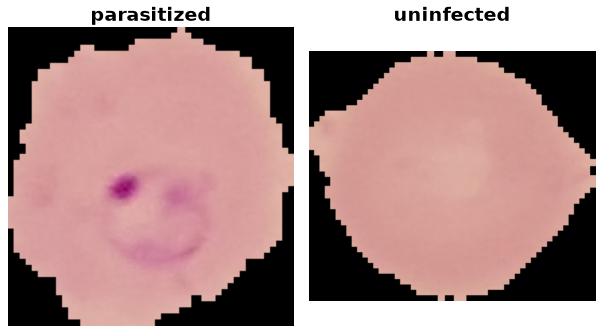

Malaria Cell Images
===================

.. raw:: html

   

   
   
   
   

Overview
--------

The NIH Malaria Cell Images dataset contains 27,558 segmented red blood cell
crops from Giemsa-stained thin blood smears. The task is binary classification
of parasitized versus uninfected cells, not patient-level diagnosis.

- **Train**: 27,558 images, with 13,779 per class
- **Images**: PNG crops with variable dimensions, converted to RGB without resizing
- **Official splits**: none; the builder exposes the entire release as ``train``
- **Downloads**: the cell-image archive and two NIH patient-to-cell mapping CSVs,
  each verified against a pinned SHA-256 checksum

Data Structure
--------------

Accessing ``ds[i]`` returns a dictionary with these fields:

.. list-table::
   :header-rows: 1
   :widths: 22 20 58

   * - Key
     - Type
     - Description
   * - ``image``
     - ``PIL.Image.Image``
     - RGB red blood cell crop with its original dimensions
   * - ``label``
     - int
     - Infection class index (0 or 1)
   * - ``filename``
     - str
     - Original cell-crop filename, including the ``.png`` extension
   * - ``patient_id``
     - str
     - Identifier from the class-specific NIH patient-to-cell CSV, with surrounding whitespace stripped
   * - ``source_image_id``
     - str
     - Microscopy image identifier: the filename prefix before ``_cell_<number>.png``

Raw access with ``ds.with_format("raw")`` returns encoded image bytes instead
of decoded PIL images. Examples are ordered deterministically by archive path.
The supervised keys are ``("image", "label")``. The builder skips non-image
archive entries such as ``Thumbs.db`` and raises an error if an accepted cell
image has no patient-mapping entry or cannot be decoded.

Classes
-------

``ds.features["label"].names`` lists class names in this fixed index order:

.. list-table::
   :header-rows: 1
   :widths: 15 55 30

   * - Label
     - Class Name
     - Images
   * - 0
     - ``parasitized``
     - 13,779
   * - 1
     - ``uninfected``
     - 13,779

Downloads and Checksum Provenance
---------------------------------

``Malaria.SOURCE.assets`` declares exactly three downloads:

- ``cell_images.zip``: the single-cell classification archive, containing the
  ``cell_images/Parasitized`` and ``cell_images/Uninfected`` directories.
  Its pinned SHA-256 digest comes from the TensorFlow Datasets Malaria checksum
  manifest linked below.
- ``patientid_cellmapping_parasitized.csv``: the NIH patient-to-cell mapping
  used to populate ``patient_id`` for parasitized cells.
- ``patientid_cellmapping_uninfected.csv``: the corresponding mapping for
  uninfected cells.

The two CSV SHA-256 digests were computed locally from the official NIH
downloads and pinned in the builder. They detect changes relative to those
downloaded versions; they are not publisher-provided checksum attestations.
All three downloads are checked against the builder's pinned digests when
newly downloaded. The CSVs are auxiliary metadata, not additional dataset splits.

The other datasets listed on the NIH datasheet, including full-resolution
smear images, thick smears, and Vivax datasets, are separate releases and are
not downloaded by this builder.

Usage Example
-------------

.. code-block:: python

    from stable_datasets.images import Malaria

    # Downloads and prepares the release on first use; subsequent loads reuse the cache.
    ds = Malaria(split="train")
    print(len(ds))  # 27558
    sample = ds[0]
    class_names = ds.features["label"].names
    print(class_names[sample["label"]])
    print(sample["patient_id"], sample["source_image_id"])

    # Omitting split returns a StableDatasetDict containing only train.
    ds_all = Malaria()
    print(list(ds_all))  # ['train']

Requesting ``test`` or ``validation`` raises an error: those splits are not
published, and the builder does not invent them.

Leakage-Aware Splitting
-----------------------

Cells from the same patient can share staining, acquisition, and microscopy
characteristics. A random cell-level split can place a patient's crops in both
training and validation, producing optimistic results. Group by the provided
``patient_id`` when constructing a patient-disjoint evaluation. Grouping only
by ``source_image_id`` is weaker because a patient can contribute multiple images.

For example, hold out 20% of the patient identifiers using
`GroupShuffleSplit <https://scikit-learn.org/stable/modules/generated/sklearn.model_selection.GroupShuffleSplit.html>`_:

.. code-block:: python

    from sklearn.model_selection import GroupShuffleSplit
    from stable_datasets.images import Malaria

    ds = Malaria(split="train")
    # Read metadata without decoding every image.
    patient_ids = [row["patient_id"] for row in ds.with_format("raw")]
    splitter = GroupShuffleSplit(n_splits=1, test_size=0.2, random_state=42)
    train_indices, validation_indices = next(
        splitter.split(range(len(ds)), groups=patient_ids)
    )
    train_ds = ds.select(train_indices)
    validation_ds = ds.select(validation_indices)

    train_patients = {patient_ids[index] for index in train_indices}
    validation_patients = {patient_ids[index] for index in validation_indices}
    assert train_patients.isdisjoint(validation_patients)

The hold-out fraction refers to patient groups, not cells, and does not
guarantee class balance. Inspect per-class counts after splitting. These are
user-created subsets of the published ``train`` release, not official splits.
The benchmark harness's default random 10% hold-out (seed 42) is a cell-level
evaluation and should not be presented as patient-disjoint performance.

References
----------

- `NIH Malaria project (builder homepage) <https://lhncbc.nlm.nih.gov/LHC-research/LHC-projects/image-processing/malaria-project.html>`_
- `NIH Malaria datasheet and patient-mapping downloads <https://lhncbc.nlm.nih.gov/LHC-research/LHC-projects/image-processing/malaria-datasheet.html>`_
- `NIH cell-image archive <https://data.lhncbc.nlm.nih.gov/public/Malaria/cell_images.zip>`_
- `NIH parasitized-cell patient mapping <https://data.lhncbc.nlm.nih.gov/public/Malaria/patientid_cellmapping_parasitized.csv>`_
- `NIH uninfected-cell patient mapping <https://data.lhncbc.nlm.nih.gov/public/Malaria/patientid_cellmapping_uninfected.csv>`_
- `TensorFlow Datasets Malaria checksum manifest <https://github.com/tensorflow/datasets/blob/master/tensorflow_datasets/datasets/malaria/checksums.tsv>`_
- `Original paper <https://doi.org/10.7717/peerj.4568>`_
- :doc:`kather_colorectal_histology`: a complementary multi-class histology benchmark

Citation
--------

.. code-block:: bibtex

    @article{rajaraman2018pre,
      title={Pre-trained convolutional neural networks as feature extractors toward
             improved malaria parasite detection in thin blood smear images},
      author={Rajaraman, Sivaramakrishnan and Antani, Sameer K and Poostchi, Mahdieh
              and Silamut, Kamolrat and Hossain, Md A and Maude, Richard J and Jaeger,
              Stefan and Thoma, George R},
      journal={PeerJ},
      volume={6},
      pages={e4568},
      year={2018},
      doi={10.7717/peerj.4568}
    }
